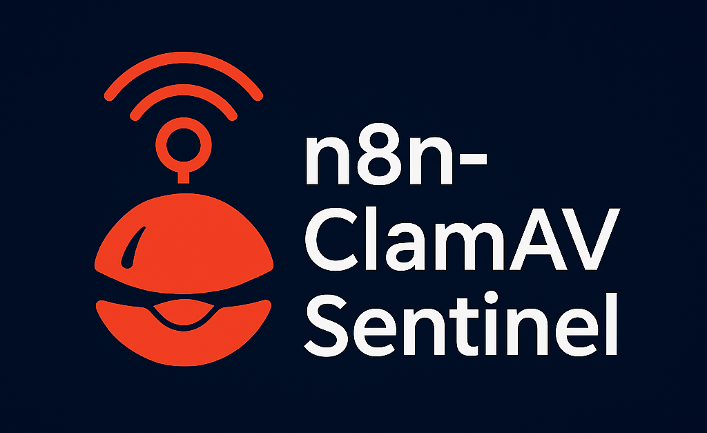
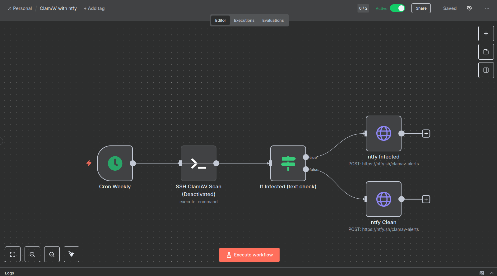

<p align="center">
  
</p>

<h1 align="center">n8n-ClamAV Sentinel</h1>
<p align="center"><em>Automated weekly ClamAV scanning and alerts via ntfy — built for n8n power users and sysadmins</em></p>

<p align="center">
  <a href="https://ko-fi.com/s/d61795e2af" target="_blank">
    
  </a>
</p>

<p align="center">
  
  
  
</p>


A full-featured **n8n workflow** that runs a **weekly ClamAV scan via SSH** and posts alerts/reports to **ntfy**.

> Triggered weekly (Sunday 03:00). Runs `clamscan`, parses results, and notifies through ntfy with rich summaries.

## Workflow Summary

- **Cron Weekly (Sun 03:00)** → **SSH ClamAV Scan** → **If Infected (text check)** →  
  • **ntfy Infected (HTTP POST)** (🚨 priority 5 with FOUND file lines + summary)  
  • **ntfy Clean (HTTP POST)** (✅ summary with counts and times)

## Features

- SSH execution of `clamscan -r /path/to/scan -i`  
- Infection alerts show top 10 lines containing `FOUND` plus scan summary  
- Clean report includes `Scanned`, `Infected`, `Time`, `Start Date`, `End Date` lines  
- Posts to `https://ntfy.sh/<your-topic>` with headers (`X-Title`, `X-Priority`)  
- Works with public or self-hosted ntfy servers

## Repo layout

```
n8n-clamav-sentinel/
├─ workflows/
│  └─ clamav_weekly_scan_full.json
├─ scripts/
│  └─ import.sh
├─ LICENSE
├─ .gitignore
└─ README.md
```

## Setup

1. Import workflow:
   - UI: Workflows → Import from File → select `workflows/clamav_weekly_scan_full.json`
   - CLI: `./scripts/import.sh`
2. In SSH node, configure credentials (`your SSH credentials`).
3. Adjust path `/path/to/scan` or schedule as needed.
4. Ensure ClamAV is installed on the remote host.

## Customization

- **Topic:** replace `https://ntfy.sh/<your-topic>` with your ntfy topic  
- **Threshold / parsing:** workflow checks for `Infected files: 0` absence to flag infection  
- **Priority:** change `X-Priority` values for clean/alert messages

## Security Notes

- Use SSH keys over passwords when possible.  
- Limit scope of user running ClamAV for safer scans.

## GitHub Quickstart

Choose HTTPS **or** SSH.

**HTTPS** (use a Personal Access Token when prompted):
```bashbash
git init
git add .
git commit -m "feat: n8n ClamAV weekly scan full → ntfy alerts"
git branch -M main
git remote add origin https://github.com/<your-username>/n8n-clamav-sentinel.git
git push -u origin main
```

## Screenshot

Here’s how the workflow looks inside n8n:



---

Built from the provided full workflow JSON. See `workflows/clamav_weekly_scan_full.json`.

### SSH alternative
```bash
git init
git add .
git commit -m "feat: n8n ClamAV sentinel → ntfy alerts"
git branch -M main
git remote add origin git@github.com:<your-username>/n8n-clamav-sentinel.git
git push -u origin main
```
